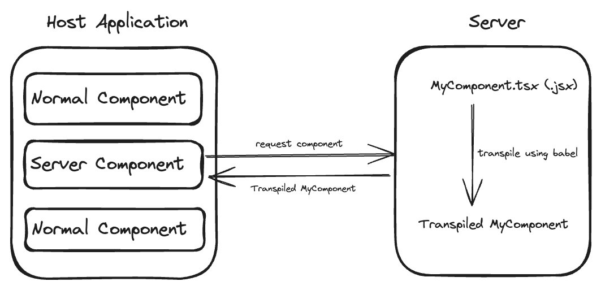

# react-native-remote-ui

React Native Remote UI allow react-native (Host) applications to render remote (Server) components. Remote components are loaded through URI at runtime. Remotely loaded components behaves similar to the locally imported components.

Remote Component are babel transpiled source code of tsx or jsx, which is executed at runtime. This gives capability to update/change UI without app release. Remote Components can use hooks like `useState` and also react lifecycle events like `useEffect`.

## Installation

```sh
npm install react-native-remote-ui
```

## Usage

### Remote Component

```tsx
// Host Application Component using RemoteComponent

import * as React from 'react';
import { View } from 'react-native';
import { RemoteComponent } from 'react-native-remote-ui';

const FallbackComponent = () => {
  return (
    <View>
      <Text> Fallback Component </Text>
    </View>
  );
};

export default function App() {
  return (
    <View style={{ flex: 1 }}>
      <RemoteComponent
        source={{ uri: 'https://api.server.com/promotion-card.jsx' }}
        fallbackComponent={<FallbackComponent />}
      />
    </View>
  );
}
```

```tsx
// Remote Component hosted on server

export const HomeComponent = () => {
  return (
    <View>
      <Text> Remote Component </Text>
    </View>
  );
};
```

### Pre Load Component

```tsx
import * as React from 'react';
import { View } from 'react-native';
import {
  RemoteComponent,
  preloadRemoteComponent,
} from 'react-native-remote-ui';

export default function App() {
  // make sure to preload before actual usage
  // components are cached againt URI

  const preloadComponent = async () => {
    try {
      const { preload } = preloadRemoteComponent({});
      await preload('https://api.server.com/player-card.jsx');
    } catch (e) {
      console.error('Failed to preload. ', e);
    }
  };

  React.useEffect(() => {
    preloadComponent();
  }, []);

  return (
    <View style={{ flex: 1 }}>
      <RemoteComponent
        source={{ uri: 'https://api.server.com/player-card.jsx' }}
        fallbackComponent={<FallbackComponent />}
      />
    </View>
  );
}
```

## How does it work?



Remote Component requires transpiled \*.tsx (jsx) code to be executed at runtime in host application. Babel is used to transpile the .tsx or .jsx file in format Remote Component can understand.

Babel command to transpile tsx or jsx

```sh
npx babel --presets=@babel/preset-env,@babel/preset-react ExampleRemoteComponent.tsx -o TranspiledExample.js
```

Transpiled source code must be served from URL to Remote Component. Since remote component executes transpiled source code at runtime, right now only vanilla react native components can be used in Remote Component. For any third party library usage, import must be resolved at runtime. Resolving imports for third party dependencies can be done by providing `global` prop. For successful import resolution at runtime, the third party dependency must be part of original bundle shipped with host application.

```tsx
// Remote Component hosted on server

import * as React from 'react';
// Buttton component used from react-native-elements
import { Button } from '@rneui/base';
import { View } from 'react-native';

const RemoteComponent = () => {
  return (
    <View>
      <Button title="Hello World!" />;
    </View>
  );
};
```

To resolve import of `Button` at runtime in host application, `global` prop must be provided to Remote Component

```tsx
// Host application component using remote component

const App = () => {
  return (
    <View>
      <RemoteComponent
        global={{
          require: (moduleId: string) => {
            if (moduleId === '@rneui/base') {
              return '@rneui/base';
            }
            return null;
          },
        }}
      />
    </View>
  );
};
```

## Props

- `source`
  The source prop of the component can accept two types of values:
  - String: When a string is provided, the component uses it directly without making an API call.
  - Object: When an object with a uri property is provided `{ uri: string }`, the component makes an API call to fetch the source from the specified URI.
- `fallbackComponent`
  - Fallback component provided to React Suspense
- `errorComponent`
  - Component to be used in case of error in RemoteComponent
- `loadingComponent`
- `onAction`
  - Callback with `action` and `payload`. Current supported actions are `NAVIGATE`, `IO`.
- `global`
  - Custom import resolution, used by Remote Component at runtime

## Handling Actions on Remote Component

Remote Component is capable of handling all the user interactions. They can emit event to let host application know about actions, host application needs to implement `onAction` callback provided by Remote Component. `onAction` callback has two parameters action type and payload

```tsx
// Host application

const handleAction = useCallback(
  (action: string, payload: Record<string, any>) => {
    switch (action) {
      case 'NAVIGATE':
        navigation.navigate(payload.route);
        break;
    }
  },
  [navigation]
);

<RemoteComponent
  source={{ uri: 'https://api.server.com/card.jsx' }}
  fallbackComponent={<FallbackComponent />}
  onAction={handleAction}
/>;
```

Action emitted contains action type and payload.

```tsx
// Example Remote Component

const ExampleRemoteComponent = ({
  onAction,
}: {
  onAction: (action: any, payload: Record<string, any>) => void;
}) => {
  const onPress = useCallback(() => {
    if (onAction) {
      onAction('NAVIGATE', { route: 'DetailsScreen' });
    }
  }, [onAction]);

  return (
    <View>
      <Pressable onPress={onPress}>
        <View>
          <Text> {`Navigation`} </Text>
        </View>
      </Pressable>
    </View>
  );
};
```

## Component Caching

Remote Components are cached in-memory for URI. Internally axios is used to fetch source from URI. `Cache-Control` header in response is used to burst cache session. `Cache-Control` should follow standard format e.g. `max-age=$value` where `value` is in milliseconds.

## Running example app

Example has `server` folder which contains express server and mocks for Remote Component.

```sh
cd example

# transpile component
yarn transpile:mock

# start server
# This will start serving transpiled mock
yarn start:server

# start metro
yarn start
```

## Contributing

See the [contributing guide](CONTRIBUTING.md) to learn how to contribute to the repository and the development workflow.

## License

MIT

---

Made with [create-react-native-library](https://github.com/callstack/react-native-builder-bob)
